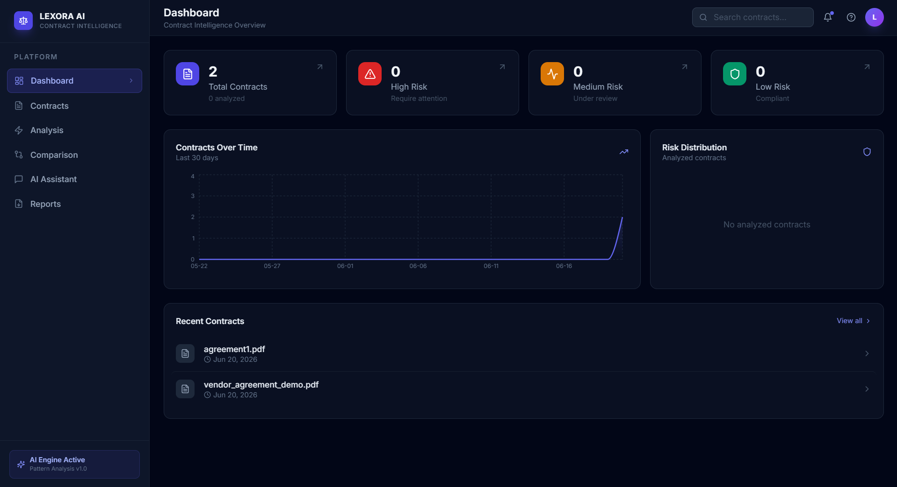
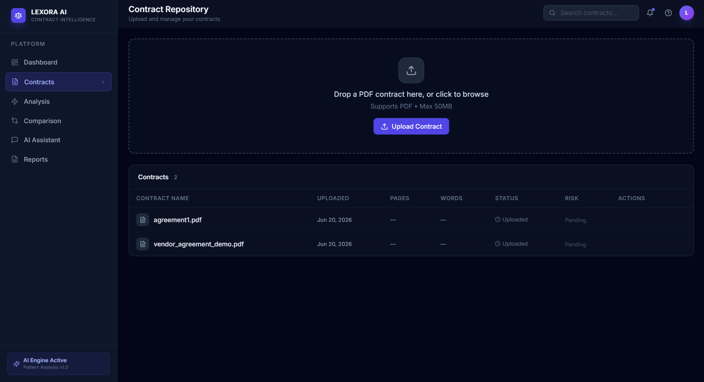
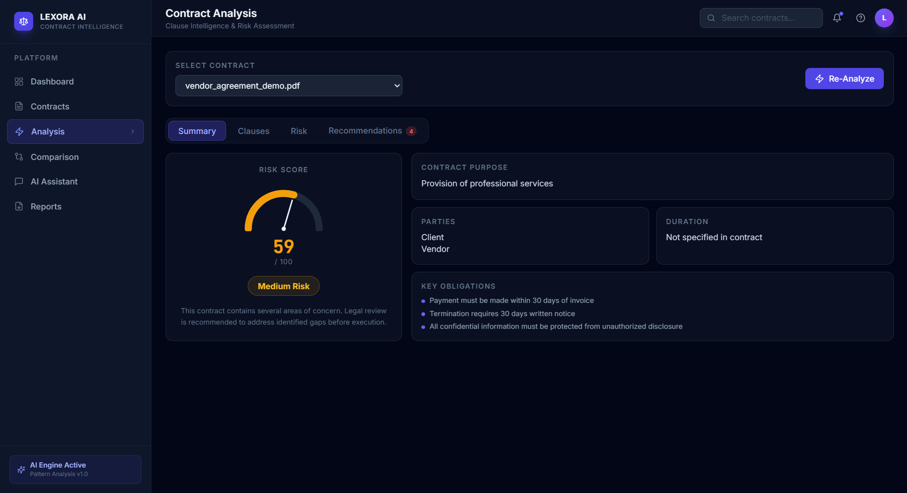
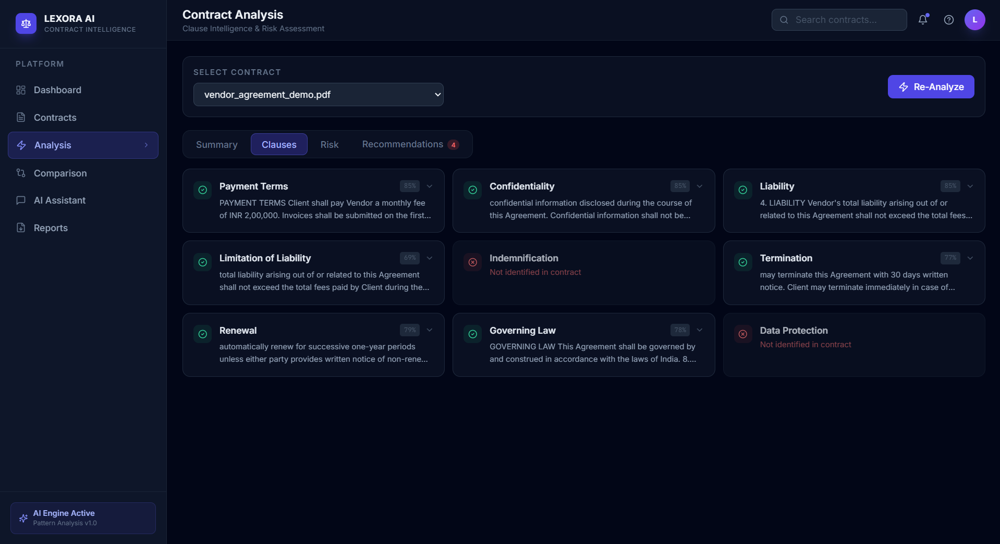
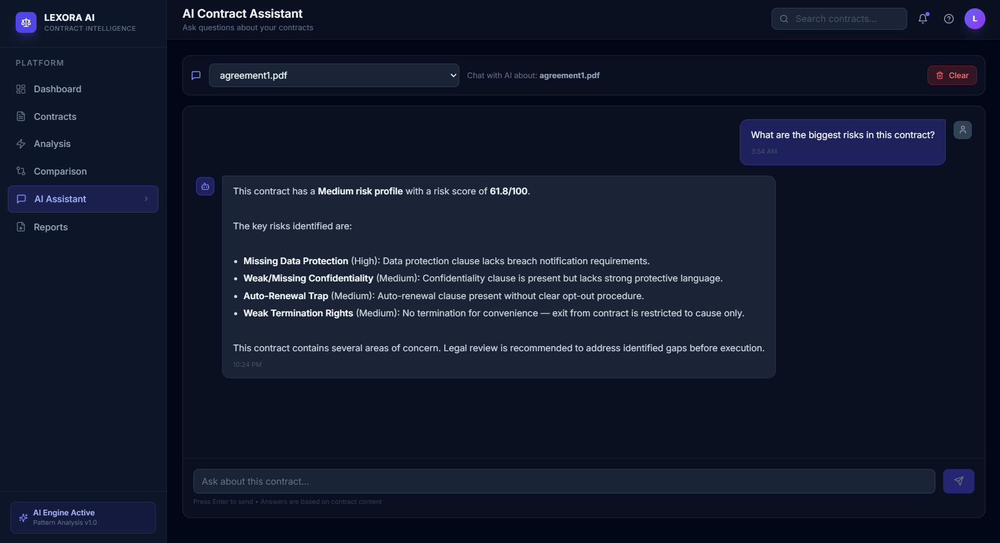
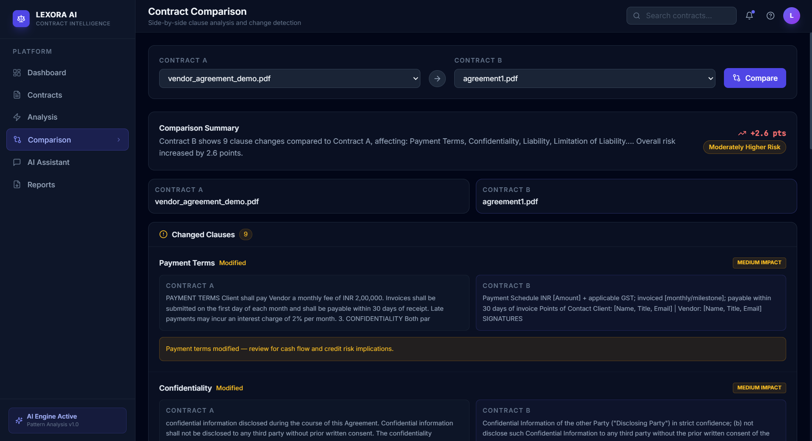
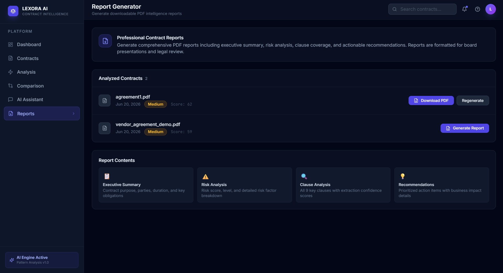

<div align="center">

<h1>⚖️ Lexora AI</h1>
<h3>Transforming Contracts into Actionable Intelligence</h3>

<p>
  An enterprise-grade AI-powered Contract Intelligence Platform that automatically extracts, analyses, and summarises legal contracts — surfacing risks, clauses, and recommendations in seconds.
</p>

<p>
  
  
  
  
  
  
</p>

</div>

---

## 📋 Table of Contents

- [Overview](#-overview)
- [Features](#-features)
- [Architecture](#-architecture)
- [Folder Structure](#-folder-structure)
- [API Endpoints](#-api-endpoints)
- [Screenshots](#-screenshots)
- [Installation Guide](#-installation-guide)
- [Future Enhancements](#-future-enhancements)

---

## 🌐 Overview

**Lexora AI** is a full-stack SaaS application that automates the most time-consuming parts of legal contract review. Users upload PDF contracts and receive a complete intelligence report — including extracted clauses, a risk score, an executive summary, prioritised recommendations, and a side-by-side comparison engine — all within seconds, with no LLM API calls or cloud dependencies required.

The platform is built for **in-house legal teams, procurement departments, and contract managers** who need to move fast without sacrificing rigour.

**What makes Lexora AI different:**

- **Fully local** — zero external API calls; all processing happens on your infrastructure
- **Explainable AI** — every risk flag and recommendation traces back to a specific clause or pattern in the contract
- **Production architecture** — service-layer pattern, typed schemas, database persistence, and clean error propagation throughout

---

## ✨ Features

### 📊 Dashboard
Real-time portfolio overview with live statistics and interactive Recharts visualisations — contracts uploaded over time, risk distribution breakdown, and clause coverage across the portfolio.

### 📁 Contract Workspace
Drag-and-drop PDF upload (up to 50 MB) with instant text extraction via `pdfplumber`. All contracts are stored with metadata (page count, word count, upload date) and managed in a searchable table.

### 🔍 Clause Intelligence
Automatic extraction of **9 critical clause types** using a multi-strategy regex + keyword-scoring engine:

| Clause Type | Description |
|---|---|
| Payment Terms | Invoice timing and late-payment provisions |
| Confidentiality | NDA and information protection obligations |
| Liability | General liability caps and exclusions |
| Limitation of Liability | Financial ceiling clauses |
| Indemnification | Hold-harmless and indemnity obligations |
| Termination | Grounds and notice periods for ending the contract |
| Renewal | Auto-renewal and rollover terms |
| Governing Law | Jurisdiction and applicable law |
| Data Protection | GDPR, privacy, and data-handling requirements |

Each clause is returned with its extracted text, a confidence score, and a found/not-found flag.

### ⚠️ Risk Assessment
A rule-based scoring engine evaluates 7 risk vectors and produces:
- A **risk score** (0–100) with calibrated weighting
- A **risk level**: High (≥ 65), Medium (≥ 35), Low (< 35)
- A structured list of risk factors with severity ratings (Critical / High / Medium / Low)

### 📝 Executive Summary
Automatic extraction of parties, contract duration, governing jurisdiction, key obligations, and top risks — formatted as a structured summary ready for stakeholder briefings.

### 💡 AI Recommendations
Each identified risk factor maps to a concrete, prioritised remediation — with business impact assessment and a suggested legal action, sorted by severity.

### 🔄 Contract Comparison
Side-by-side clause-level diff between any two analysed contracts. Detects **modified, added, removed, and unchanged** clauses with impact ratings and a computed risk delta.

### 🤖 AI Assistant
An intent-aware conversational interface for asking natural-language questions about any analysed contract. Handles 12 intents (risk, parties, duration, payment, governing law, data protection, and more) with keyword-fallback for open-ended queries. Full chat history is persisted per contract.

### 📄 Report Generator
One-click generation of a professional multi-page PDF report (via `reportlab`) with branded header, executive summary, full risk breakdown, clause inventory, and recommendations table — ready for distribution.

---

## 🏛 Architecture

```
┌─────────────────────────────────────────────────────────────────────┐
│                         BROWSER  :5173                              │
│                                                                     │
│   ┌──────────┐  ┌──────────┐  ┌──────────┐  ┌───────────────────┐  │
│   │Dashboard │  │Contracts │  │Analysis  │  │  AI Assistant     │  │
│   └──────────┘  └──────────┘  └──────────┘  └───────────────────┘  │
│   ┌──────────┐  ┌──────────┐  ┌──────────┐                         │
│   │Comparison│  │ Reports  │  │  TopNav  │                         │
│   └──────────┘  └──────────┘  └──────────┘                         │
│          │               React 18 + Vite + TailwindCSS              │
│          │ axios  /api/*  (Vite proxy)                              │
└──────────┼──────────────────────────────────────────────────────────┘
           │
           ▼ HTTP / JSON
┌─────────────────────────────────────────────────────────────────────┐
│                     FastAPI  :8000  /api                            │
│                                                                     │
│   ┌────────────┐  ┌──────────┐  ┌──────────┐  ┌────────────────┐   │
│   │ /contracts │  │/analysis │  │   /chat  │  │   /dashboard   │   │
│   └────────────┘  └──────────┘  └──────────┘  └────────────────┘   │
│   ┌────────────┐  ┌──────────┐                                      │
│   │/comparison │  │ /reports │                                      │
│   └────────────┘  └──────────┘                                      │
│                        │  API Layer                                 │
│          ┌─────────────▼─────────────────────────────┐             │
│          │          contract_service  (orchestrator)  │             │
│          └────────────────────────────────────────────┘             │
│          ┌──────────┐ ┌──────────┐ ┌──────────┐ ┌──────────────┐   │
│          │ clause_  │ │  risk_   │ │ summary_ │ │recommenda-   │   │
│          │extractor │ │ engine   │ │ engine   │ │tion_engine   │   │
│          └──────────┘ └──────────┘ └──────────┘ └──────────────┘   │
│          ┌──────────────────┐  ┌────────────┐  ┌──────────────┐    │
│          │comparison_engine │  │chat_service│  │report_service│    │
│          └──────────────────┘  └────────────┘  └──────────────┘    │
│                        │  Service Layer                             │
│          ┌─────────────▼───────────────────────────────────────┐   │
│          │     SQLAlchemy ORM  ·  SQLite  ·  pdfplumber         │   │
│          │     Contract · ContractAnalysis · ChatMessage        │   │
│          └─────────────────────────────────────────────────────┘   │
└─────────────────────────────────────────────────────────────────────┘
```

**Design Principles**

- **Service Layer Pattern** — all business logic lives in `app/services/`; API routes are thin and only handle HTTP concerns
- **Typed at Every Boundary** — Pydantic v2 schemas validate all request/response payloads; SQLAlchemy models own the persistence layer
- **Explainability First** — no opaque ML models; every output is traceable to specific text patterns in the source document
- **Graceful Degradation** — `pdfplumber` and `reportlab` imports are guarded; analysis failures set contract status to `"error"` without corrupting other records

---

## 📁 Folder Structure

```
LexoraAI/
│
├── backend/
│   ├── requirements.txt
│   └── app/
│       ├── main.py                     # FastAPI app, CORS, router registration
│       ├── api/
│       │   ├── contracts.py            # Upload, list, view, delete, serve file
│       │   ├── analysis.py             # Trigger analysis, fetch results
│       │   ├── comparison.py           # Side-by-side clause comparison
│       │   ├── chat.py                 # AI assistant messages + history
│       │   ├── reports.py              # PDF report generation + download
│       │   └── dashboard.py            # Portfolio stats and chart data
│       ├── services/
│       │   ├── contract_service.py     # Central orchestrator
│       │   ├── clause_extractor.py     # 9-clause regex + scoring engine
│       │   ├── risk_engine.py          # Weighted rule-based risk scoring
│       │   ├── summary_engine.py       # Executive summary generator
│       │   ├── recommendation_engine.py# Risk → remediation mapper
│       │   ├── comparison_engine.py    # Clause diff engine
│       │   ├── chat_service.py         # Intent-based Q&A engine
│       │   └── report_service.py       # ReportLab PDF builder
│       ├── models/
│       │   └── contract.py             # Contract, ContractAnalysis, ChatMessage ORM
│       ├── schemas/
│       │   └── contract.py             # Pydantic v2 request/response schemas
│       ├── database/
│       │   └── db.py                   # Engine, session, Base, create_tables()
│       └── utils/
│           └── pdf_utils.py            # PDF text extraction, word count, helpers
│
├── frontend/
│   ├── vite.config.js                  # Vite + /api proxy config
│   ├── tailwind.config.js              # Custom dark glassmorphism theme
│   └── src/
│       ├── App.jsx                     # BrowserRouter + 6 routes
│       ├── main.jsx
│       ├── index.css                   # Tailwind base + custom utilities
│       ├── layouts/
│       │   ├── MainLayout.jsx          # Page wrapper with title/subtitle
│       │   ├── Sidebar.jsx             # Navigation with active state
│       │   └── TopNav.jsx              # Top bar header
│       ├── pages/
│       │   ├── Dashboard.jsx           # Stats cards + Recharts visualisations
│       │   ├── Contracts.jsx           # Upload, manage, analyse contracts
│       │   ├── Analysis.jsx            # 4-tab clause/risk/summary/recommendations view
│       │   ├── Comparison.jsx          # Side-by-side contract diff
│       │   ├── Assistant.jsx           # AI chat interface with history
│       │   └── Reports.jsx             # Generate and download PDF reports
│       └── services/
│           └── api.js                  # 18 typed axios API functions
│
├── database/
│   └── lexora.db                       # SQLite database (auto-created)
│
├── uploads/                            # Uploaded PDF files (auto-created)
├── reports/                            # Generated PDF reports (auto-created)
├── start.ps1                           # One-command dev startup script
└── README.md
```

---

## 🔌 API Endpoints

Base URL: `http://127.0.0.1:8000/api`

Interactive docs available at `/api/docs` (Swagger UI) and `/api/redoc`.

### Contracts

| Method | Endpoint | Description |
|--------|----------|-------------|
| `POST` | `/contracts/upload` | Upload a PDF contract (multipart/form-data, max 50 MB) |
| `GET` | `/contracts/` | List all contracts with summary metadata |
| `GET` | `/contracts/{id}` | Get a single contract record |
| `DELETE` | `/contracts/{id}` | Delete a contract and its associated file |
| `GET` | `/contracts/{id}/file` | Stream the original PDF (inline, for viewer) |

### Analysis

| Method | Endpoint | Description |
|--------|----------|-------------|
| `POST` | `/analysis/{id}/analyze` | Run the full analysis pipeline on a contract |
| `GET` | `/analysis/{id}` | Retrieve previously computed analysis results |

### Comparison

| Method | Endpoint | Description |
|--------|----------|-------------|
| `POST` | `/comparison/` | Compare two analysed contracts `{ contract_a_id, contract_b_id }` |

### AI Assistant

| Method | Endpoint | Description |
|--------|----------|-------------|
| `POST` | `/chat/{id}/message` | Send a question and receive an AI response |
| `GET` | `/chat/{id}/history` | Retrieve full chat history for a contract |
| `DELETE` | `/chat/{id}/history` | Clear all chat messages for a contract |

### Reports

| Method | Endpoint | Description |
|--------|----------|-------------|
| `POST` | `/reports/{id}/generate` | Generate a PDF intelligence report |
| `GET` | `/reports/{id}/download` | Download the most recently generated report |

### Dashboard

| Method | Endpoint | Description |
|--------|----------|-------------|
| `GET` | `/dashboard/stats` | Portfolio-level counts and risk summary |
| `GET` | `/dashboard/contracts-over-time` | Daily upload counts for the last 30 days |
| `GET` | `/dashboard/risk-distribution` | Risk level breakdown for Pie chart |
| `GET` | `/dashboard/clause-coverage` | Average clause coverage across all contracts |
| `GET` | `/dashboard/recent-contracts` | Last 5 uploaded contracts |

### Health

| Method | Endpoint | Description |
|--------|----------|-------------|
| `GET` | `/health` | Service health check |

---

## 📸 Screenshots

### Dashboard — Portfolio Overview



*Real-time portfolio statistics, risk distribution, clause coverage analytics, and contract upload trends.*

---

### Contracts Management



*Centralized contract repository with upload, tracking, and lifecycle management.*

---

### Contract Analysis — Risk Assessment



*Weighted risk scoring, severity classification, and AI-generated legal risk insights.*

---

### Contract Analysis — Clause Intelligence



*Automated extraction and categorization of legal clauses with confidence scoring.*

---

### AI Legal Assistant



*Natural language contract Q&A with contextual legal guidance and conversation history.*

---

### Contract Comparison



*Side-by-side comparison of contracts with detected additions, removals, modifications, and impact analysis.*

---

### Reports & Executive Summary



*Professional report generation including executive summaries, risk analysis, and recommendations.*


> **Note:** To add screenshots, place `.png` files in `docs/screenshots/` matching the filenames above.

---

## 🚀 Installation Guide

### Prerequisites

| Requirement | Version |
|-------------|---------|
| Python | 3.10 or 3.11 |
| Node.js | 18+ |
| npm | 9+ |
| (Optional) Anaconda / Miniconda | Any |

---

### 1. Clone the Repository

```bash
git clone https://github.com/your-username/lexora-ai.git
cd lexora-ai
```

---

### 2. Set Up the Python Backend

**Option A — Conda (recommended)**

```bash
conda create -n lexora-ai python=3.11 -y
conda activate lexora-ai
pip install -r backend/requirements.txt
```

**Option B — Standard virtualenv**

```bash
python -m venv .venv

# Windows
.venv\Scripts\activate
# macOS / Linux
source .venv/bin/activate

pip install -r backend/requirements.txt
```

---

### 3. Set Up the React Frontend

```bash
cd frontend
npm install
```

---

### 4. Run the Application

**Terminal 1 — Backend**

```bash
cd backend
python -m uvicorn app.main:app --host 127.0.0.1 --port 8000 --reload
```

**Terminal 2 — Frontend**

```bash
cd frontend
npm run dev
```

Then open **http://localhost:5173** in your browser.

> The `uploads/`, `reports/`, and `database/` directories are created automatically on first startup.

---

### 5. One-Command Startup (Windows PowerShell)

A convenience script is included at the project root:

```powershell
.\start.ps1
```

This opens both servers in separate PowerShell windows.

---

### 6. Verify the Installation

| Check | URL |
|-------|-----|
| Frontend | http://localhost:5173 |
| Backend health | http://127.0.0.1:8000/api/health |
| Swagger UI | http://127.0.0.1:8000/api/docs |
| ReDoc | http://127.0.0.1:8000/api/redoc |

---

### Environment Variables (Optional)

Currently all settings are hardcoded for local development. To customise, create `backend/.env`:

```env
# CORS
CORS_ORIGINS=http://localhost:5173,http://127.0.0.1:5173

# Paths (defaults: project root subdirectories)
UPLOADS_DIR=./uploads
REPORTS_DIR=./reports
DATABASE_URL=sqlite:///./database/lexora.db

# Limits
MAX_UPLOAD_SIZE=52428800
```

---

## 🔭 Future Enhancements

| Enhancement | Description | Priority |
|---|---|---|
| **LLM Integration** | Plug in OpenAI / Ollama / local LLaMA for semantic clause understanding beyond regex | High |
| **User Authentication** | JWT-based login with per-user contract workspaces using the already-installed `python-jose` and `passlib` | High |
| **Multi-format Support** | Extend PDF extraction to handle DOCX, TXT, and scanned PDFs via OCR (Tesseract) | Medium |
| **Batch Processing** | Upload and analyse multiple contracts simultaneously with a job queue (Celery + Redis) | Medium |
| **Clause Redlining** | Inline annotation and redline markup on the PDF viewer with export back to DOCX | Medium |
| **Custom Playbooks** | Allow teams to define their own clause requirements and risk thresholds per contract type | Medium |
| **Email Notifications** | Alert stakeholders when a contract reaches a risk threshold or analysis completes | Low |
| **Audit Trail** | Immutable event log for every action (upload, analyse, comment, export) for compliance purposes | Low |
| **Multi-language Contracts** | Extend clause extraction patterns to French, German, and Spanish contracts | Low |
| **Vector Search** | Embed clauses with sentence-transformers for semantic similarity search across the portfolio | Low |

---

## 🛠 Tech Stack

### Backend
| Library | Version | Role |
|---------|---------|------|
| FastAPI | 0.111 | REST API framework |
| SQLAlchemy | 2.0 | ORM and database abstraction |
| Pydantic | 2.7 | Schema validation |
| pdfplumber | 0.11 | PDF text extraction |
| ReportLab | 4.2 | PDF report generation |
| Uvicorn | 0.29 | ASGI server |

### Frontend
| Library | Version | Role |
|---------|---------|------|
| React | 18.3 | UI framework |
| Vite | 5.2 | Build tool and dev server |
| TailwindCSS | 3.4 | Utility-first styling |
| Recharts | 2.12 | Data visualisation |
| Axios | 1.7 | HTTP client |
| react-dropzone | 14.2 | Drag-and-drop file upload |
| lucide-react | 0.395 | Icon library |

---

## 📄 License

This project is licensed under the MIT License. See [LICENSE](LICENSE) for details.

---

<div align="center">
  <p>Built with precision and purpose.</p>
  <p><strong>Lexora AI</strong> — Transforming Contracts into Actionable Intelligence</p>
</div>

